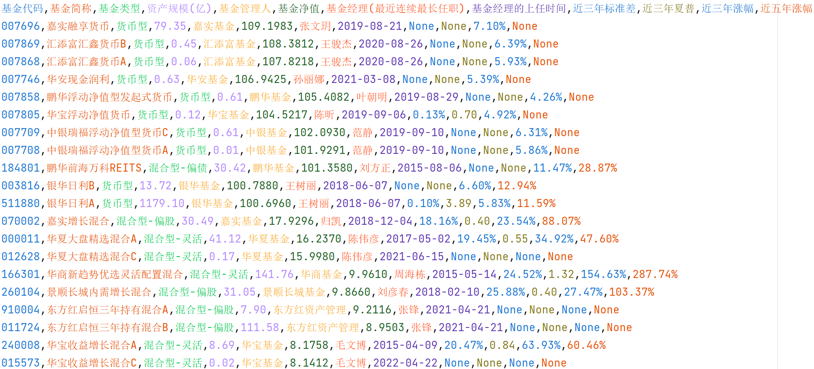
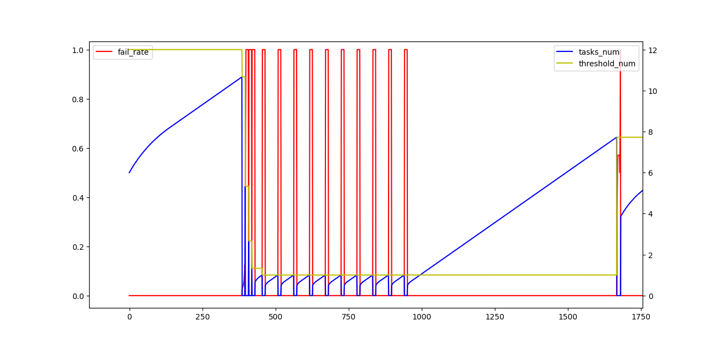

# 天天基金爬虫

## 简介

#### 重要提示

        购买基金前，请务必在官方网站上确认爬取的数据无误！
        推荐书籍《解读基金：我的投资观与实践》
        推荐网站 晨星中国：www.morningstar.cn

- 基金类型,资产规模,基金管理人,基金净值,基金经理(最近连续最长任职),基金经理的上任时间,近三年标准差,近三年夏普,近三年涨幅,近五年涨幅
- 爬取全部数据需要5385s(2023-04-29 总基金数16445)，瓶颈为网站的反爬策略
  

# 食用方法

- Python3.11 依赖见requirements.txt
- 运行run.py 爬取基金数据
- 杂七杂八
  - 只想爬一点点数据看下效果 test_process_manager.SmokeTestTaskManager.test_run
  - 爬了很多我不需要的数据，很慢 module.crawling_data.async_crawling_data.AsyncCrawlingData.__init__
  - 爬取过程中的日志文件 process_manager.TaskManager.\_\_init__
  - 爬取结果文件 module.save_result.save_result_2_file.SaveResult2File.\_\_init__
  - 爬取结果分析 (通过堆，取三年夏普最高的前几个基金)utils.result_analyse.analyse
  - 想爬取更多的数据  
1 看下现有的爬取网页上是否有对应的信息  
module.crawling_data.data_mining.data_mining_type.PageType
有的话，直接在对应的策略上，通过正则或其他的方式将信息提取出来  
没有的话，新增一个策略，爬取新的网页，以及进行对应的清洗

# 技术相关

- 因为数据清洗和 http下载分别是计算密集和IO密集的，为了避免GIL和频繁的线程切换影响效率。
AsyncHttpRequestDownloader起了一个新进程，在子进程内通过线程池进行http的爬取，通过队列来交换爬取任务和结果，通过事件来感知爬取结束
- 目前的爬取瓶颈是网站的反爬策略，可以通过utils.downloader.rate_control.rate_control_analyse.draw_analyse来分析当前网络环境下
所能支持的并发任务数  
当前的速率控制策略是 1 通过环 记录和计算最近几次的任务爬取失败率（避免过于敏感）  
2.1 失败率大于0，并发任务数的阈值修改为当前值的一半（在失败率恢复之前，只修改一次），当前的并发任务数修改为0  
2.2 失败率等于0，当前值=max(阈值*1/2, 当前并发任务数+步长)，当 当前值和阈值的距离越大时，步长越大（尽快恢复原有的爬取速率）
当 当前值大于阈值时，步长为固定值（缓慢增长，试探是否有进一步加速的空间）

## Star History

