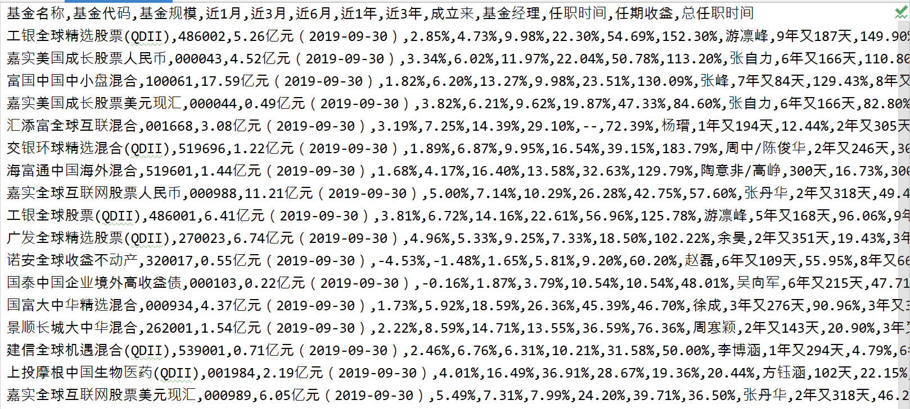

# 天天基金爬虫

爬取天天基金网上的所有基金，辅助对基金投资的选择

#### 购买基金前，请务必在官方网站上确认爬取的数据无误！

### 2021-01-24更新 若存在问题，请切换回Release版本

## 功能特性

- 爬取基金的近1、3、6月，近1、3年及成立来的收益率，当前基金经理及其任职时间、任职来的收益率及总的任职时间
- 模仿tcp的拥塞避免的线程数量控制，慢开始，当出现错误时，线程最大值减半，成功则线程最大值+1
- 爬取全部数据需要505s，瓶颈为网站的反爬策略

- 结果展示
  
  2021-01-24 共有10203个基金

## 食用方法

- 环境依赖 运行环境Python3.7 依赖见requirements.txt
- 下载所有.py脚本文件（除MonkeyTest外）
- 爬取基金数据
    - 运行CrawlingFund.py并等待
- ~~筛选基金~~ 还没做
- ~~基金分析~~ 也没做

## 文件结构

        -CrawlingFund 爬取主文件，描述整个的爬取逻辑并定义了基金信息的数据结构
        -CrawlingCore 爬取核心，定义了从输入网页链接到获得html文本的过程
        -FakeUAGetter 提供虚假的UA（将来可能会合并到工具文件）
        -Parser 负责html文本的解析，以及解析后的动作（保存文件），通过不同的实现类来针对性地对不同的网站内容进行解析
        -FundListProvider 负责提供需要爬取的基金列表，包括基金名称、代码
        -MonkeyTest 这是给我自己测试用的

## 更新计划
- 重构
- 增加新的爬取字段
    - 标准差
    - 夏普比率
    - 净值 （包括单位、累计和实时估算）
- 增加能按收益率等初步对基金进行筛选的脚本