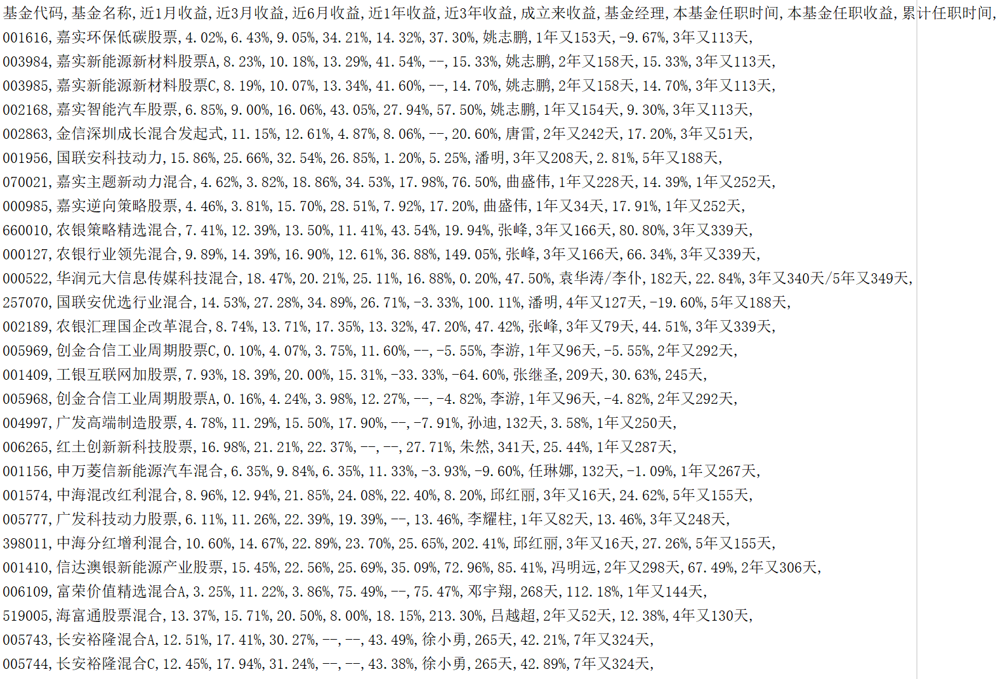

# 天天基金爬虫
爬取天天基金网，辅助对基金投资的选择

## 功能特性
- 爬取天天基金网上所有的基金，及相应基金经理，以往的收益率等

- 模仿tcp的拥塞避免的线程数量控制，慢开始，当出现错误时，线程最大值减半，成功则线程最大值+1
- 爬取全部数据需要305s（不使用代理），瓶颈为网站的反爬策略
- ~~支持代理ip 理论上可大大提升爬取效率（需简单修改代码）~~ （貌似出现了问题）
    - 爬取免费代理的脚本在另一个profile，crawler_tools，爬取的对象为西刺所提供的免费代理ip
    - 由于免费代理ip非常不稳定，单次测试出现了比原本更慢的情况
- 结果展示

    2019/08/29 共有7225个基金，其中有5个处于封闭期或已终止无法爬取

## 食用方法
- 下载脚本文件 fundcrawler.py
- 下载 FakeUA.py

      这一步非必须，若无，则会在爬取的全程中使用唯一的chrome ua，可能会影响到爬取的效率
      也可自己实现FakeUA类，在爬取脚本中会通过 FakeUA().random 获取 随机的ua(str)
- 设置爬取后的基金筛选条件
      
      这一步非必须，可以按照自行使用excel或者python脚本处理
      若有，则程序会将筛选的结果保存到XXX-choice文件，需要在代码的末尾处对筛选条件进行修改，修改的代码段为
      choice_return = {'近1月收益': 6.41, '近3月收益': 24.55, '近6月收益': 10.91, '近1年收益': -3.64,
                     '近3年收益': 18.35, '成立来收益/保本期收益': 0, '本基金任职收益': 0}
      choice_time = {'本基金任职时间': [1, 0], '累计任职时间': [3, 0]}
      替换数字即可（筛选留下大于等于全部设定数值的基金） 对于任职时间的两个数字，前一个为本基金，后一个为基金经理

- 运行fundcrawler.py并等待

## 以后的更新
- TODO （11月前）
    - 功能更新
        - 爬取部分
            - 对基金规模的爬取和筛选
            - 混合型、债卷型的筛选分离
        - 数据可视化 （计划做个简单的晴雨表？显示这个月多少基金赚钱，多少赔钱）
    - 重构 （或者叫 看effective python有感）
        - 优化现有多线程爬取，改用线程池
