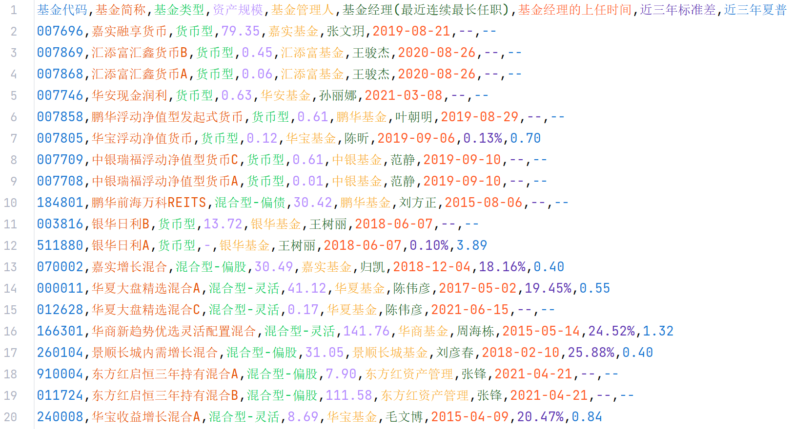

# 天天基金爬虫

## 简介

#### 重要提示

        购买基金前，请务必在官方网站上确认爬取的数据无误！
        推荐书籍《解读基金：我的投资观与实践》
        推荐网站 晨星中国：www.morningstar.cn
        2023-04-29对整个代码进行了重写，如有问题，请切换回deprecated分支

- 基金类型,资产规模,基金管理人,基金经理(最近连续最长任职),基金经理的上任时间,近三年标准差,近三年夏普
- 爬取全部数据需要4190s(2023-04-29 总基金数16445)，瓶颈为网站的反爬策略
  

# 食用方法

- Python3.11 依赖见requirements.txt
- 运行run.py 爬取基金数据

# 技术相关

## 更新计划

- 木有计划
