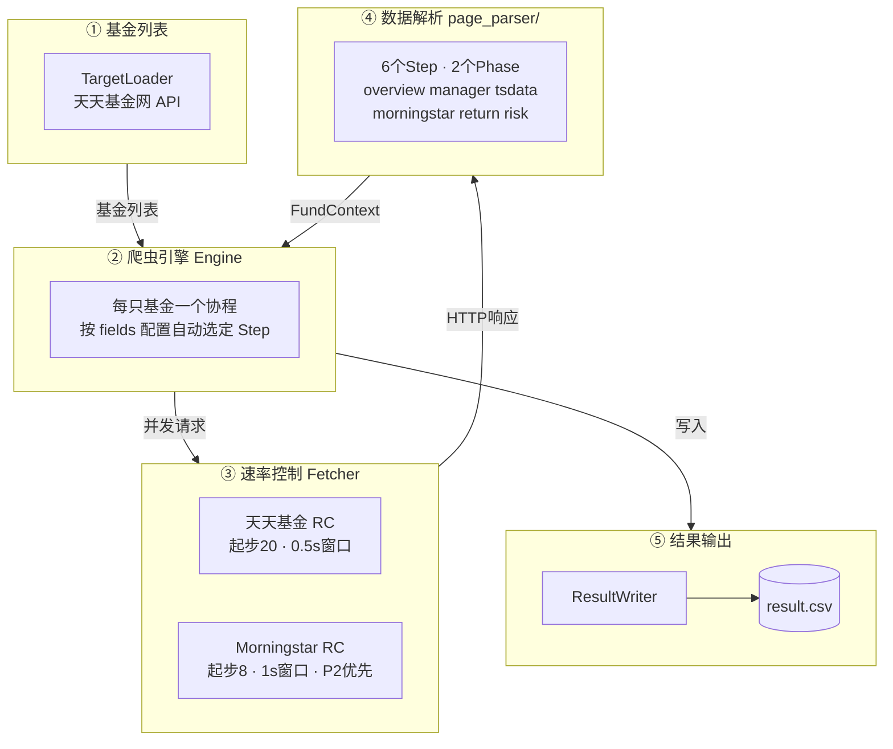
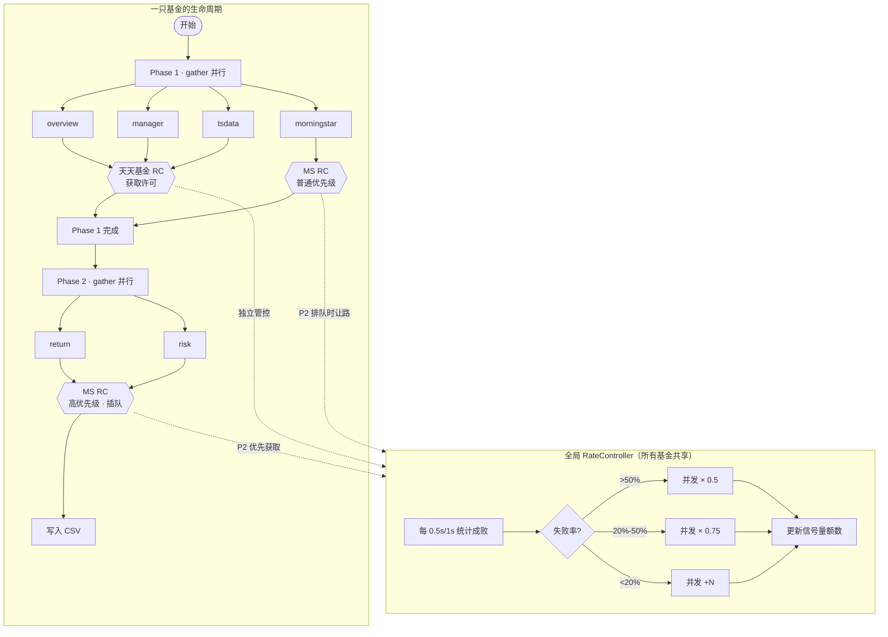

# 基金数据爬虫

#### 重要提示

- 202605 重大代码修改（纯DS设计+编码），报错/奇怪bug，尝试切换PreviousReleaseVersion分支使用

        购买基金前，请务必在官方网站上确认爬取的数据无误！
        爬虫仅供学习交流使用，请不要对目标网站造成负担，并在心里默默感谢网站提供的免费数据
        推荐书籍《聪明的投资者》、《投资最重要的事》
        推荐网站 晨星中国：www.morningstar.cn

- 爬取的数据

        所有的开放式基金（包括目前暂停申购和认购中的基金，不包括货币/场内基金）
        基金代码,基金简称,(晨星)基金代码,基金类型,资产规模(亿),基金管理人,基金净值
        基金经理(最近连续最长任职),基金经理的上任时间
        管理费率(每年),托管费率(每年),销售服务费率(每年)
        标准差(近三年),夏普比率(近三年)
        五年回报(年化),十年回报(年化)
        标准差(五年%),标准差(十年%),夏普比率(五年),夏普比率(十年)
        阿尔法系数(相对于基准指数%),贝塔系数(相对于基准指数),R平方(相对于基准指数)

- 爬取全部数据需要22min左右（23529个基金），取决于网络环境，瓶颈为网站的反爬策略
- 默认只爬天天基金数据，不爬晨星。晨星 WAF 反爬严格，如需爬取晨星数据，修改 run.py 中 fields = TT_MS_FULL

# 食用方法

- Python3.14
- 安装依赖 pip install -r requirements.txt
- 额外安装 aiohttp（不在 requirements.txt 中）：pip install aiohttp
- 爬取基金数据
  - 结果保存在 result/result.csv
  - 运行test_run.py 爬10只基金验证
  - 运行run.py 爬取完整数据
  - 可选：修改 run.py 中 fields 切换数据范围（TT_BASIC / TT_STANDARD / TT_MS_FULL）
- 结果中若存在 DATA_ERROR，可重爬错误基金 error_data_rerun.py
- 爬取结果分析，参考 result_analyse.py
  - **纯债**（稳健仓）：长债/中短债（排除混合二级）→ 名含纯债/信用债/利率债/中短债 → 经理 ≥ 5年 → 规模 > 20亿 → 排定开/定期 → 夏普 3Y 前 40% → 费率最低 20
  - **权益**（收益仓）：偏股/灵活/股票/平衡型 → 经理 ≥ 5年 → 规模 > 10亿 → 销售服务费 = 0（排除 C 类等）→ 排定开/定期/持有/滚动 → 夏普 3Y 前 30% → 费率最低 20
  - 人工从两个候选池各选一只，比例自定

# 技术相关
## 架构

```mermaid
flowchart TB
    subgraph 输入["① 基金列表"]
        TL[TargetLoader<br/>天天基金网 API]
    end

    subgraph 核心["② 爬虫引擎 Engine"]
        E[每只基金一个协程<br/>按 fields 配置自动选定 Step]
    end

    subgraph 网络["③ 速率控制 Fetcher"]
        direction LR
        RC_EM[天天基金 RC<br/>起步20 · 0.5s窗口]
        RC_MS[Morningstar RC<br/>起步8 · 1s窗口 · P2优先]
    end

    subgraph 解析["④ 数据解析 page_parser/"]
        direction LR
        STEPS[6个Step · 2个Phase<br/>overview manager tsdata<br/>morningstar return risk]
    end

    subgraph 输出["⑤ 结果输出"]
        WR[ResultWriter] --> CSV[(result.csv)]
    end

    输入 -->|基金列表| 核心
    核心 -->|并发请求| 网络
    网络 -->|HTTP响应| 解析
    解析 -->|FundContext| 核心
    核心 -->|写入| 输出
```

每只基金根据 fields 配置自动选择 Step（含传递依赖），按依赖自动分两阶段——morningstar ID 就绪后 Phase 2 才开始。每个 phase 内 `gather` 并行，瓶颈只取决于最慢的那个 step。

## 流程（动态并发控制）

从**一只基金的视角**看完整流程，以及它在哪些环节被 RateController 管控：

```mermaid
flowchart TB
    subgraph fund["一只基金的生命周期"]
        start([开始]) --> p1[Phase 1 · gather 并行]
        p1 --> ov[overview] & mg[manager] & td[tsdata] & ms[morningstar]
        ov --> em1{{天天基金 RC<br/>获取许可}}
        mg --> em1
        td --> em1
        ms --> ms1{{MS RC<br/>普通优先级}}
        em1 --> p1done[Phase 1 完成]
        ms1 --> p1done
        p1done --> p2[Phase 2 · gather 并行]
        p2 --> ret[return] & risk[risk]
        ret --> ms2{{MS RC<br/>高优先级 · 插队}}
        risk --> ms2
        ms2 --> write[写入 CSV]
    end

    subgraph rc["全局 RateController（所有基金共享）"]
        loop["每 0.5s/1s 统计成败"] --> adj{失败率?}
        adj -- ">50%" --> dec5[并发 × 0.5]
        adj -- "20%-50%" --> dec75[并发 × 0.75]
        adj -- "<20%" --> inc[并发 +N]
        dec5 --> limit[更新信号量额数]
        dec75 --> limit
        inc --> limit
    end

    ms2 -.->|P2 优先获取| rc
    ms1 -.->|P2 排队时让路| rc
    em1 -.->|独立管控| rc
```

**关键机制**：

- 每个 Step 发出 HTTP 请求前必须通过对应域名的 RC 信号量——有空额直接通过，没空额排队等。
- Phase 2 请求在 Morningstar RC 中**高优先级**：释放额数时优先唤醒 Phase 2 等待者。
- AIMD 双阈值：重度失败(>50%) ×0.5 快速退让，轻度失败(20-50%) ×0.75 温和调整。
- **Morningstar 无限重试**：每次 HTTP 尝试（含重试）都走 RC 获取/释放许可，匹配网站视角的真实 QPS。网络不可达时 RC 自动退到 `min=1`——单并发持续探测，网络恢复后 AIMD 自动爬升。

| 域名 | 起步并发 | 步长 | 策略 |
|------|---------|------|------|
| 天天基金 | 20 | +1 | 无反爬，稳 |
| Morningstar | 8 | **+3** | 保守起步，无限重试，min=1 退化 · P2 优先 |

所有接口统一 3s 超时，TT 2 次重试，MS 无限重试。
### 扩展点

换基金来源 → 实现 `TargetLoader`；加数据源 → 添加 `Step` 到 `STEPS`，设置 `provides` 声明产出字段；换输出格式 → 替换 `ResultWriter`。
