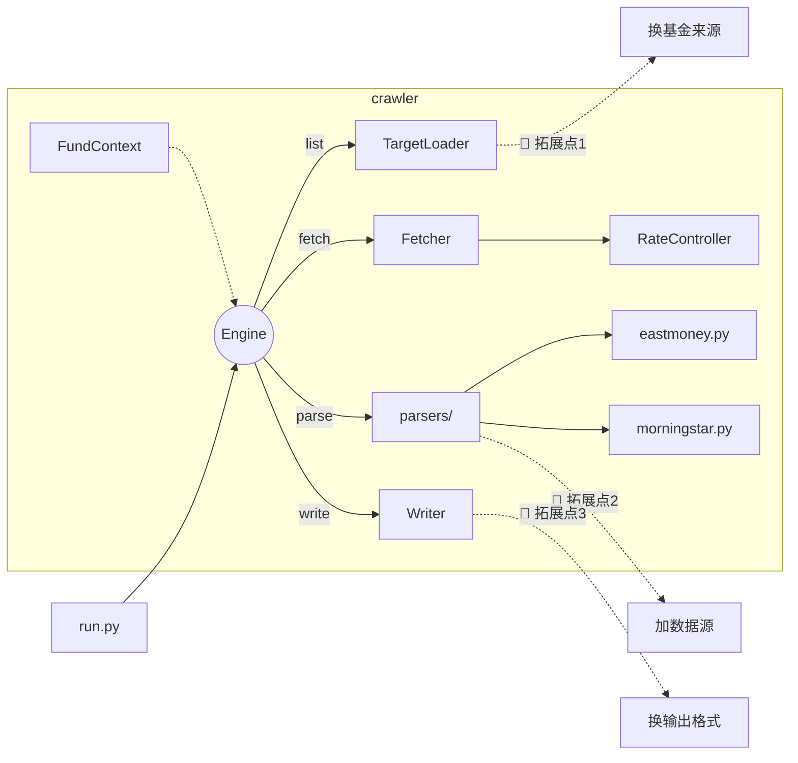

# 基金数据爬虫

#### 重要提示

- 202605 重大代码修改（纯AI重构），报错/奇怪bug，尝试切换PreviousReleaseVersion分支使用

        购买基金前，请务必在官方网站上确认爬取的数据无误！
        爬虫仅供学习交流使用，请不要对目标网站造成负担，并在心里默默感谢网站提供的免费数据
        推荐书籍《聪明的投资者》、《投资最重要的事》
        推荐网站 晨星中国：www.morningstar.cn

- 爬取的数据

        所有的开放式基金（包括目前暂停申购和认购中的基金，不包括货币/场内基金）
        基金代码,基金简称,(晨星)基金代码,基金类型,资产规模(亿),基金管理人,基金净值
        基金经理(最近连续最长任职),基金经理的上任时间
        管理费率(每年),托管费率(每年),销售服务费率(每年)
        五年回报(年化),十年回报(年化)
        标准差(五年%),标准差(十年%),夏普比率(五年),夏普比率(十年)
        阿尔法系数(相对于基准指数%),贝塔系数(相对于基准指数),R平方(相对于基准指数)

- 爬取全部数据需要30min左右（21032个基金），取决于网络环境，瓶颈为网站的反爬策略

# 食用方法

- Python3.14
- 安装依赖 pip install -r requirements.txt
- 爬取基金数据
  - 结果保存在 result/result.csv
  - 运行test_run.py 爬一点点数据看下效果
  - 运行run.py 爬取完整数据
- 爬取结果分析，参考 result_analyse.py

# 未来更新计划
作者太懒了，什么也没有留下

# 技术相关

```mermaid
graph LR
  run[run.py] --> engine((Engine))

  subgraph crawler
    engine -->|list| loader[TargetLoader]
    engine -->|fetch| fetcher[Fetcher]
    fetcher --> rc[RateController]
    engine -->|parse| parsers[parsers/]
    parsers --> eastmoney[eastmoney.py]
    parsers --> morningstar[morningstar.py]
    engine -->|write| writer[Writer]
    ctx[FundContext] -.-> engine
  end

  loader -.->|🔄 拓展点1| L[换基金来源]
  parsers -.->|🔄 拓展点2| P[加数据源]
  writer -.->|🔄 拓展点3| W[换输出格式]
```
自适应流量控制：在线探测失败率，动态调节并发上限。
每只基金一个协程，根据 `STEPS` 依赖声明自动分组并发——依赖深度是唯一瓶颈，页面数量不是。

# Star History

