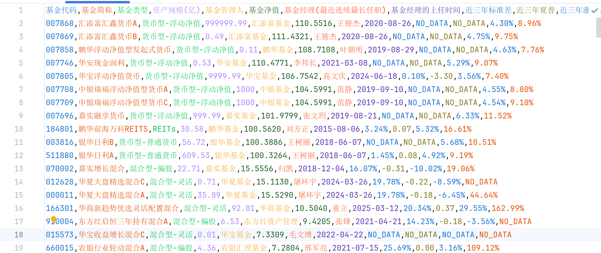
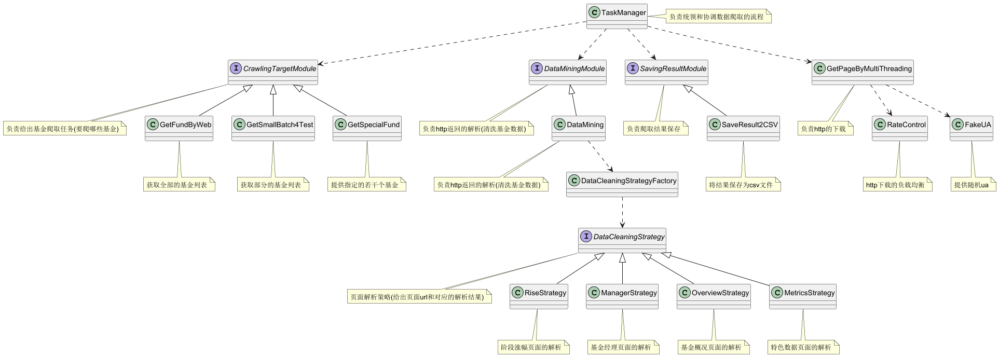
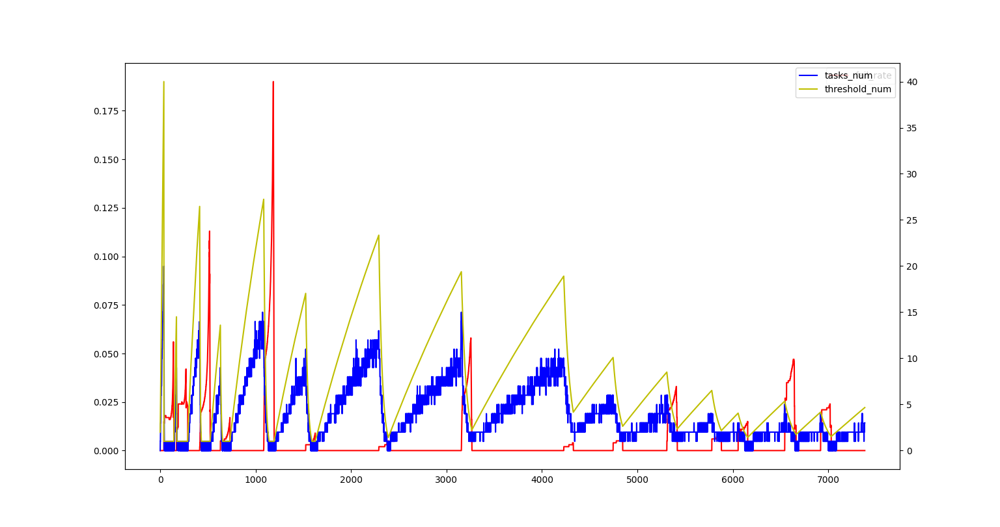

# 基金数据爬虫

## 简介

#### 重要提示

- 202505 重大代码修改，报错/奇怪bug，尝试切换previous_release_version分支使用

        购买基金前，请务必在官方网站上确认爬取的数据无误！
        爬虫仅供学习交流使用，请不要对目标网站造成负担，并在心里默默感谢网站提供的免费数据
        推荐书籍《聪明的投资者》、《投资最重要的事》
        推荐网站 晨星中国：www.morningstar.cn

- 基金类型,资产规模,基金管理人,基金净值,基金经理(最近连续最长任职),基金经理的上任时间,近三年标准差,近三年夏普,近三年涨幅,近五年涨幅
- 爬取全部数据需要26min左右（20619个基金），取决于网络环境，瓶颈为网站的反爬策略
  

# 食用方法

- Python3.13
- 安装依赖 pip install -r requirements.txt
- 运行run.py 爬取基金数据
- 杂七杂八
  - 只想爬一点点数据看下效果 运行test_run.py
  - 爬取结果分析，参考 utils/result_analyse.py
  - 需要更多的数据  
    现在爬取涉及到的页面有你想要的数据吗 utils.constants.PageType  
    1 有 找到对应的策略类，增加对应数据的解析逻辑  
    2 没有 新增一个策略，实现需要爬取的url和对应的页面解析逻辑

# 技术相关

- (结合profile分析)爬虫的瓶颈在于网站的反爬策略
  - 爬取1000个基金，总耗时约35s
  - 获取要爬取的1000个基金目录 get_small_batch_4_test.py:18(get_fund_list) 调用1次 耗时0.9813s
  - http数据解析模块 data_mining.py:12(summit_context) 调用2000次 耗时1.544s
  - 基金结果保存 save_result_2_file.py:27(save_result) 调用1000次 耗时0.03239s
  - 其余时间都花在了等待http返回上，因此需要尽可能得打满http请求
    - 1 为了避免GIL和频繁的线程切换影响效率，http下载模块是单独的子进程，通过管道通信，并在主流程中优先处理http请求的提交
    - 2 主流程的循环中，需要尽量避免出现http请求队列为空的情况
    - 3 module.downloader.rate_control.rate_control.RateControl  
      单独设置一个速率控制类，尝试寻找一个最合适的并发数  
      失败惩罚 成功奖励 并发数的变化率随迭代数的增加而降低
      

## Star History

## 未来更新计划
- 健壮性
  - 有没有数学上的方法，基于一定数量的抽样验证，就能确认整体数据的正确性
